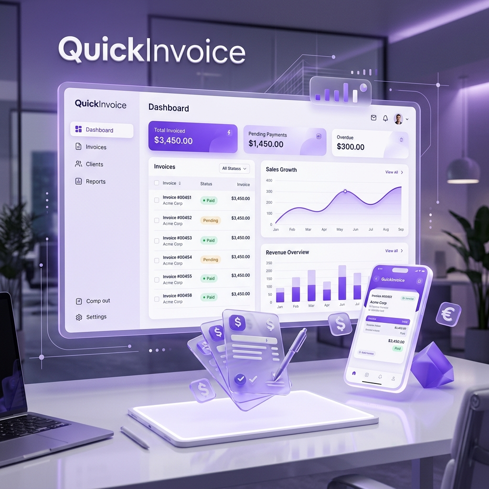

# QuickInvoice



Production-ready invoice management SaaS for freelancers and small businesses.


## 🚀 Overview

QuickInvoice is a comprehensive solution designed to streamline the billing process for modern professionals. From invoice generation with live PDF previews to automated email notifications and client management, QuickInvoice provides everything needed to manage business finances efficiently.

## ✨ Key Features

### 📊 Professional Dashboard
- **Revenue Insights**: Track your performance with detailed revenue overview and trend indicators.
- **Visual Analytics**: Interactive monthly revenue charts for the last 6 months.
- **Activity Feed**: Stay updated with a table of recent invoices and quick action shortcuts.

### 📝 Smart Invoice Management
- **Live PDF Preview**: See changes in real-time as you build your invoice.
- **Dynamic Line Items**: Drag-and-drop reordering for maximum flexibility.
- **Automatic Calculations**: Instant subtotal, tax, and discount computations.
- **Multi-page Support**: Professional A4 PDF generation that scales with your content.
- **Status Lifecycle**: Track invoices from Draft → Sent → Viewed → Paid.
- **Digital Signatures**: Add a personal touch with integrated signature support.

### 👥 Client & Inventory Management
- **CRM Lite**: Manage clients with dedicated profiles and full invoice histories.
- **Inventory Tracking**: (Experimental) Keep track of your products and services for faster invoicing.
- **Bulk Import**: Support for CSV-based inventory imports.

### ⚙️ Business Personalization
- **Profile Management**: Custom business details including logo, address, and contact info.
- **Smart Defaults**: Configure default currency, payment terms, and invoice prefixes.
- **Storage Integration**: Secure logo and document storage via Supabase.

## 🛠️ Tech Stack

### Frontend
- **Framework**: [Next.js 14](https://nextjs.org/) (App Router)
- **Styling**: [Tailwind CSS](https://tailwindcss.com/)
- **Animations**: [Framer Motion](https://www.framer.com/motion/)
- **Form Handling**: [React Hook Form](https://react-hook-form.com/) + [Zod](https://zod.dev/)
- **Data Fetching**: [TanStack Query v5](https://tanstack.com/query/latest)
- **Icons**: [Lucide React](https://lucide.dev/)

### Backend
- **Runtime**: [Node.js](https://nodejs.org/)
- **Server**: [Express](https://expressjs.com/) with TypeScript
- **ORM**: [Prisma](https://www.prisma.io/)
- **Caching**: [Redis](https://redis.io/) (via ioredis)
- **Email**: [Nodemailer](https://nodemailer.com/) / [Resend](https://resend.com/)
- **PDF Generation**: [@react-pdf/renderer](https://react-pdf.org/)

### Infrastructure
- **Database**: [Supabase](https://supabase.com/) (PostgreSQL)
- **Auth**: Supabase Auth (JWT & Magic Links)
- **Storage**: Supabase Storage

## 🏁 Getting Started

### Prerequisites
- Node.js 18+
- npm 9+
- A Supabase Project
- Redis Instance (optional for local dev, recommended for prod)

### 1. Installation
```bash
# Clone the repository
git clone https://github.com/AmanTiwari404/quickinvoice.git
cd quickinvoice

# Install dependencies for all workspaces
npm install
```

### 2. Environment Setup
Create `.env` files in the respective directories:

**Web (`apps/web/.env.local`)**:
```env
NEXT_PUBLIC_SUPABASE_URL=your_supabase_url
NEXT_PUBLIC_SUPABASE_ANON_KEY=your_anon_key
NEXT_PUBLIC_API_URL=http://localhost:3001/api
```

**API (`apps/api/.env`)**:
```env
PORT=3001
SUPABASE_URL=your_supabase_url
SUPABASE_SERVICE_ROLE_KEY=your_service_role_key
DATABASE_URL=your_postgres_connection_string
REDIS_URL=your_redis_url
SMTP_HOST=your_smtp_host
SMTP_USER=your_smtp_user
SMTP_PASS=your_smtp_pass
FRONTEND_URL=http://localhost:3000
```

### 3. Database Initialization
Run the following script in your Supabase SQL Editor to set up the schema:
- `supabase/setup_fresh_database.sql`

### 4. Running Locally
```bash
# Start both frontend and backend
npm run dev

# Or start individually
npm run dev:web
npm run dev:api
```

## 📜 License
This project is licensed under the MIT License - see the [LICENSE](LICENSE) file for details.

## 🤝 Contributing
Contributions are welcome! Please feel free to submit a Pull Request.

---
Built with ❤️ by [AmanTiwari404](https://github.com/AmanTiwari404)
